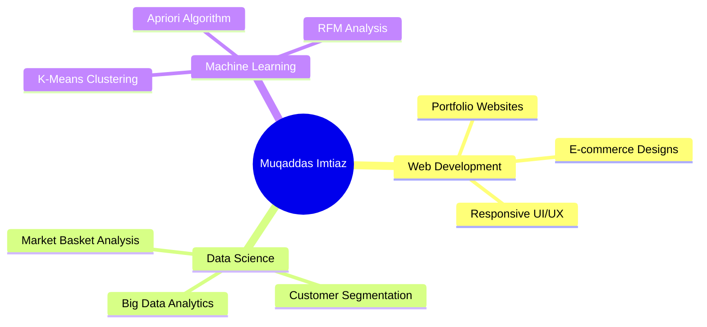

```markdown
<div align="center">

# 

### 🎓 Data Science Student @ QUEST Nawabshah  
### 💻 Web Developer | Big Data Analytics Enthusiast

</div>

---

## 🧑‍💻 About Me

```python
class MuqaddasImtiaz:
    def __init__(self):
        self.name = "Muqaddas Imtiaz"
        self.education = "BS Data Science | QUEST Nawabshah"
        self.skills = ["Python", "SQL", "HTML/CSS/JS", "Java", "C"]
        self.interests = ["Big Data", "Machine Learning", "Web Development"]
    
    def current_focus(self):
        return "Final Year Project | Market Basket & Customer Segmentation"
    
    def goals(self):
        return "Building impactful data-driven solutions"
```

---

## 📊 GitHub Stats

<div align="center">

|  |  |
|:---:|:---:|
|  |  |

</div>

---

## 🎯 Current Project

<div align="center">

### 🛒 Market Basket & Customer Segmentation Analysis

[](https://customer-segmentation-dashboard.netlify.app/)
[](https://www.kaggle.com/code/muqaddasimtiaz/market-basket-customer-segmentation)
[](https://github.com/Muqadas-g/Market-Basket-Customer-Segmentation-FYP)

</div>

**📌 Project Highlights:**

```
┌─────────────────────────────────────────────────────────────┐
│  ✅ 458 Association Rules Discovered                        │
│  ✅ 4 Customer Segments (VIP, Loyal, At-Risk, Occasional)   │
│  ✅ Interactive Real-time Dashboard                         │
│  ✅ Apriori Algorithm + K-Means Clustering                  │
│  ✅ RFM Analysis for Customer Profiling                     │
└─────────────────────────────────────────────────────────────┘
```

---

## 🛠️ Tech Toolbox

<div align="center">

### Languages


### Frontend


### Data Science


### Tools


</div>

---

## 📈 GitHub Activity

<div align="center">


</div>

---

## 🐍 Contribution Snake

<div align="center">


</div>

---

## 🚀 What I'm Working On



---

## 📫 Connect With Me

<div align="center">

[](https://www.linkedin.com/in/muqaddas-imtiaz-5635b0301)
[](https://github.com/Muqadas-g)
[](https://www.kaggle.com/code/muqaddasimtiaz/market-basket-customer-segmentation)
[](mailto:muqaddasjutt57@gmail.com)
[](https://www.fiverr.com/pe/pdlxXgp)

</div>

---

## 📊 Weekly Activity

<!--START_SECTION:waka-->
```text
Python        ████████████████████░░░░   78.4%
HTML/CSS      ████████░░░░░░░░░░░░░░░░   28.2%
JavaScript    ██████░░░░░░░░░░░░░░░░░░   22.5%
SQL           ████░░░░░░░░░░░░░░░░░░░░   15.3%
```
<!--END_SECTION:waka-->

---

## 🏆 GitHub Trophies

<div align="center">


</div>

---

## 💬 Quote of the Day

<div align="center">

> *"Data is the new oil, but it's only valuable when refined."*

</div>

---

## 📌 Recent Activity

<!--RECENT_ACTIVITY:start-->
- ✅ Completed Final Year Project on Market Basket Analysis
- 🚀 Deployed Live Dashboard on Netlify
- 📓 Published Kaggle Notebook with 458 Association Rules
- 💻 Created Professional GitHub Profile README
<!--RECENT_ACTIVITY:end-->

---

## ✨ Fun Fact

```javascript
console.log("I don't just study Data Science — I build real-world intelligent systems!");
```

---

<div align="center">

### 🌟 *"Code. Create. Innovate."* 🌟

**© 2025 Muqaddas Imtiaz | All Rights Reserved**


</div>
```


